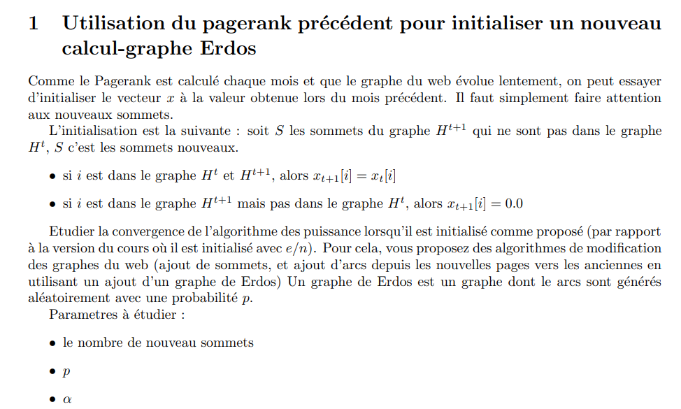

## <u>💻 Sujet 💻</u>

#### <u>💻 Execution du programme 💻</u>
Pour executer le programme il faut juste créer un dossier nommé 'data' contenant les 6 fichiers texte (graphes du web)  
 1- wb-cs-stanford.txt
 2- Stanford.txt
 3- Stanford_BerkeleyV2
 4- in-2004v2.txt
 5- wikipedia-20051105V2.txt
 6- wb-edu.txt